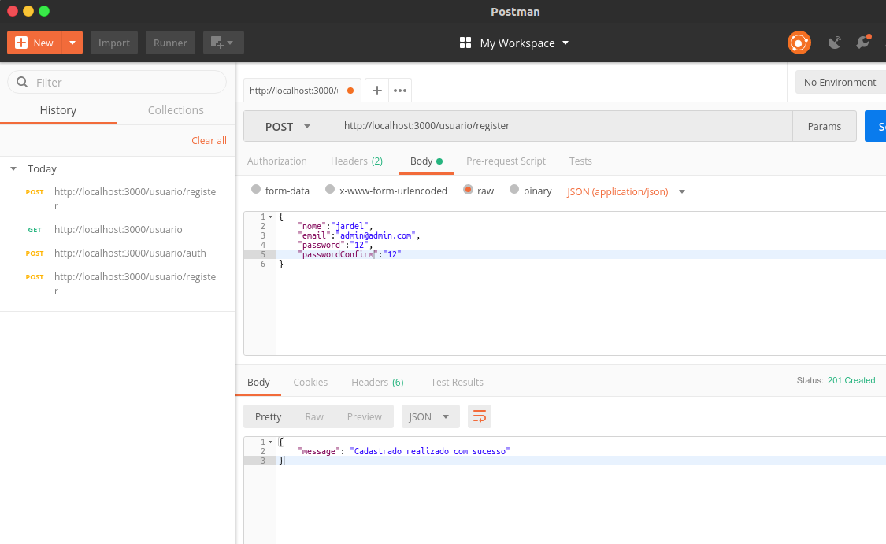
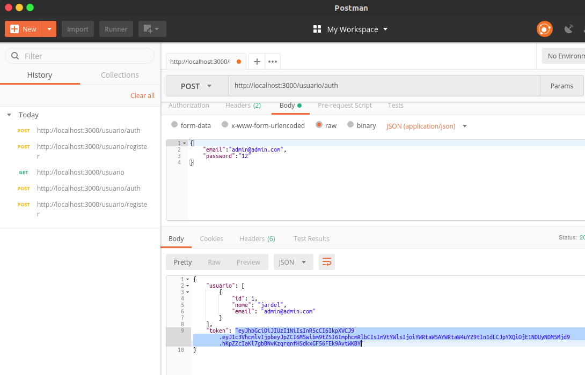
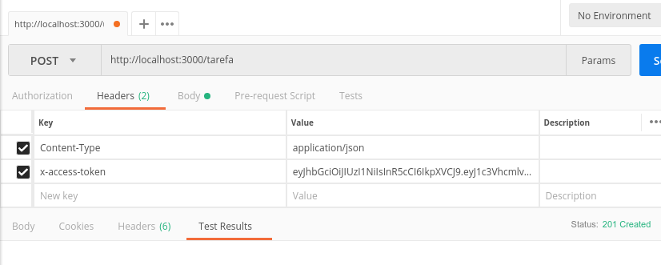
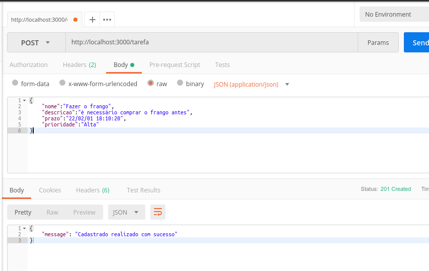
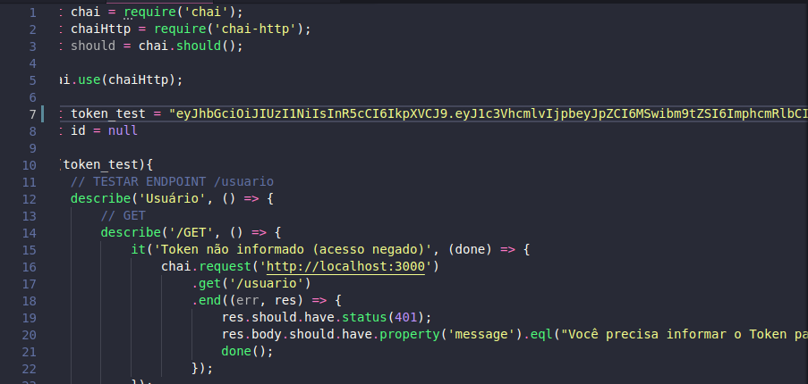
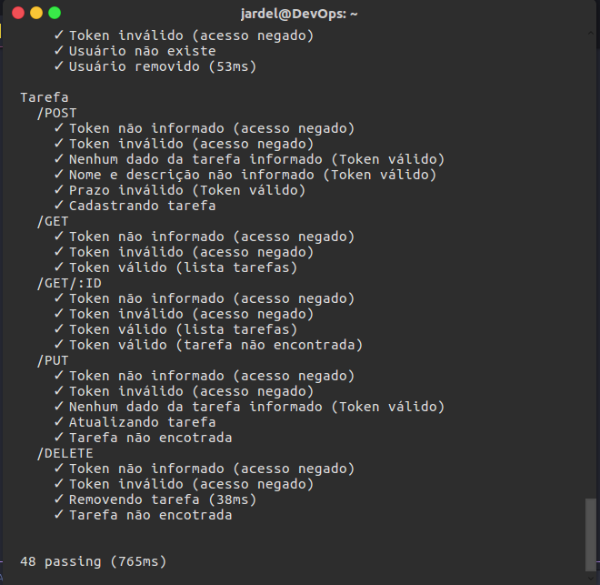

# Desafio HostWeb - Backend

## Executando APP
Utilizamos o ambiente Docker para facilitar a execução do APP. Inicialemente é necessário fazer o o clone do repositório. Assumimos que o usuário tenha instalado em sua máquina o Docker (utilziamos a versão 18.09.0) e o docker-compose (utilizamos a versão 1.21.2). Para rodar o APP, no diretório do projeto execute o seguinte comando:
```
docker-compose up
```
Após finalizar o build, o APP subirá automaticamente. O contêiner com a imagem do mysql pode demorar um pouco pois além de subir o banco de dados ele executa o .sql para criar o banco e as tabelas, caso seja executado alguma requisão antes do banco ser criado, uma resposta com o código 503 é retornado.

Após o App e o banco de dados subir, para fazer requisições para os endpoints /tarefa (GET, POST, PUT e DELETE) ou /usuario (GET, DELETE e PUT) é necessário enviar um token no cabeçalho da requisição. Para obter o Token é necessário se autenticar no servidor, como não há usuário no servidor vamos cadastrar um:

Para criar um usuário precisamos enviar um objeto JSON com os seguintes campos:
```
{
    "nome":"nome do usuário",
    "email":"email do usuário",
    "password":"senha do usuário",
    "passwrodConfirm":"confirmação da senha"
}
```
Na figura abaixo podemos observar o cadastro de um usário utilizando o software Postman:

<p align="center">
  
</p>

Após cadastrar um usuário no servidor, podemos autenticá-lo para obter o token, como ilustrado na figura abaixo:

<p align="center">
  
</p>

**OBS: É aconselhado copiar o token para utilizar nas proximas consultas e para executar os testes unitários**

Para enviar o Token ao servidor, é necessário informar no cabeçalho da requisição uma chave `x-access-token` atribuindo o token a mesma, como podemos observar na figura a seguir:

<p align="center">
  
</p>

Feito a configuração no cabeçalho, podemos realizar requisições aos recursos que necessita de autenticação, na figura abaixo é realizado um  POST (Adicionar tarefa) ao endpoint /tarefa informando no corpo da mensagem um objeto JSON. 

<p align="center">
  
</p>

Não é informado o atributo `concluida`, pois tem o valor `0` (false) como default no banco de dados.

Para executar os testes unitários, é necessário editar no arquivo `test/test.js` informando a variável `test_token` (linha 7) o valor de um token válido, caso não seja informado alguns testes que necessita de um token válido falhará. A figura a seguir apresenta a variável e como deve ser inserido o token (entre ás aspas).

<p align="center">
  
</p>

Vale ressaltar que não há a necessidade de parar a execução da aplicação pois no arquivo `docker-compose.yml` o volume é mapeado para o contêiner, ou seja, qualquer mudança no arquivo na máquina é refletida no cotêiner.

Feito a configuração do token no arquivo `test/test.js`, abra um novo terminal e execute o comando abaixo para executar os testes unitário (altere o NAME/ID-do-conteiner-app para o seu caso):
```
docker exec NAME/ID-do-conteiner-app npm test
```

A figura abaixo apresenta o resultado do comando para rodar os testes.

<p align="center">
  
</p>
